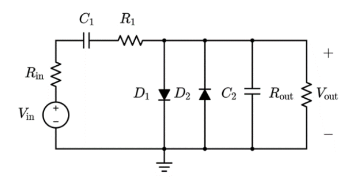
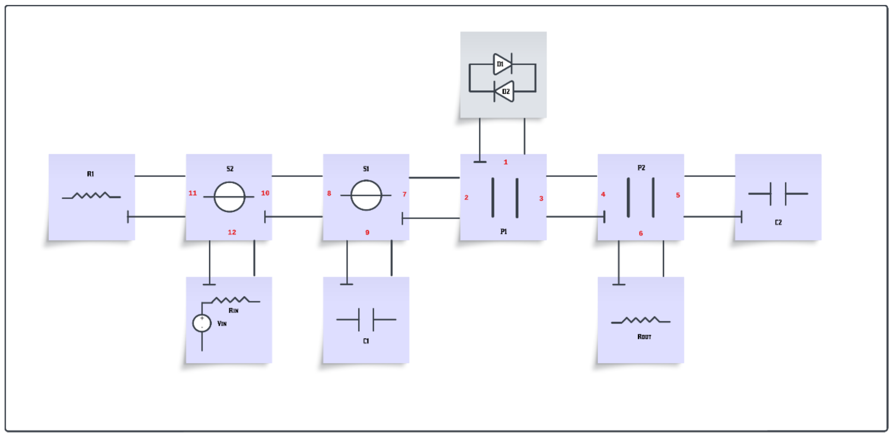
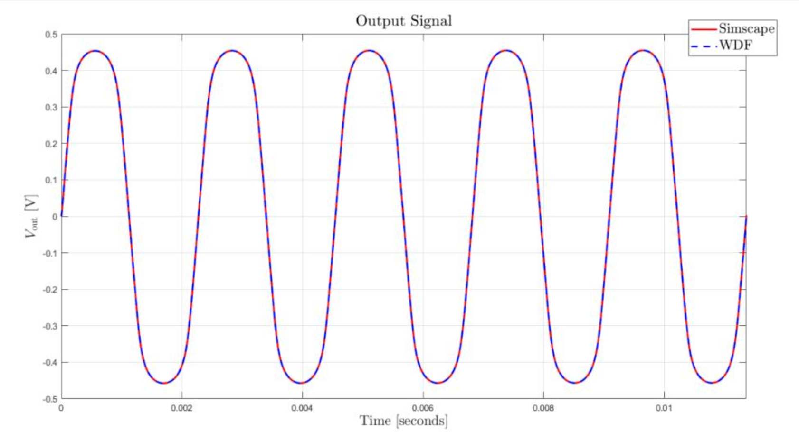
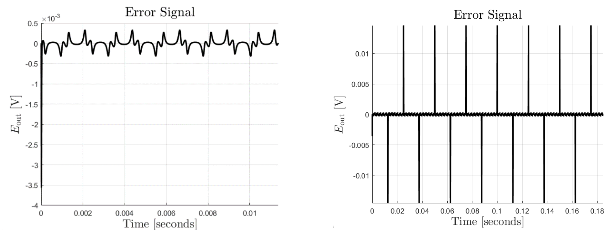

# Wave Digital Filter (WDF) Modeling of MXR Distortion+

## Project Overview
This project is part of the **Sound Analysis, Synthesis, and Processing (SSSP)** course at **Politecnico di Milano**. The objective is to model the clipping stage of the famous **MXR Distortion+** guitar pedal using the **Wave Digital Filter (WDF)** approach. The implementation is based on the analog electrical circuit shown below:



## Project Structure
The project consists of the following key components:

- **Analog Circuit Description:**  
  The MXR Distortion+ pedal consists of three main sections:
  1. **Op-amp stage:** Provides high input impedance and amplification.
  2. **Clipping stage:** Implements distortion using antiparallel diodes.
  3. **Power supply stage:** Supplies the necessary operating voltage.

- **Wave Digital Filter (WDF) Implementation:**  
  The analog circuit is translated into a WDF model using port-wise wave variable representation and the scattering relations for the elements.

## Repository Contents

| File                   | Description                                           |
|-----------------------|-------------------------------------------------------|
| `finalCode.m`          | The main MATLAB script implementing the WDF model.    |
| `antiparallel_diodes.m`| Function modeling the antiparallel diode pair.        |
| `Lambert_W_Fritsch.m`  | Implementation of the Lambert W function for diode modeling. |
| `diode_clipper_SSC.slx`| Simulink model of the analog reference circuit.        |
| `ssc_output.mat`       | Ground-truth output from Simscape simulation.         |
| `HOMEWORK_SASP2.pdf`   | The project report with detailed explanations and results. |

## Technical Implementation Details

### 1. WDF Scheme Description

- **Root:** The root of the WDF is the nonlinear port element, which in this case consists of the two antiparallel diodes (𝐷1, 𝐷2).

- **Parallel Junctions (𝑷𝟏 and 𝑷𝟐):**  
  - 𝑷𝟏: Connected to the root, 𝑷𝟐, and the series junction 𝑺𝟏.  
  - 𝑷𝟐: Connected to capacitor 𝐶2 and the output resistor 𝑅𝑜𝑢𝑡, forming a parallel network.  

- **Series Junctions (𝑺𝟏 and 𝑺𝟐):**  
  - 𝑺𝟏: Connected to 𝑷𝟏 and attached to 𝐶1 and 𝑺𝟐.  
  - 𝑺𝟐: Connected to resistor 𝑅1 and the input signal 𝑉𝑖𝑛 and 𝑅𝑖𝑛.



---

### 2. Setting of Free Parameters

The adaptation conditions for the ports are as follows:

$$
Z_{11} = R1, \quad Z_{12} = R_{\text{in}}, \quad Z_{9} = \frac{T_s}{2C_1}, \quad Z_{6} = R_{\text{out}}, \quad Z_{5} = \frac{T_s}{2C_2}
$$

To make the ports reflection-free, the following calculations are made:

$$
Z_{10} = Z_{11} + Z_{12}, \quad Z_{8} = Z_{10}, \quad Z_{7} = Z_{8} + Z_{9}, \quad Z_{4} = \frac{Z_5 \cdot Z_6}{Z_5 + Z_6}, \quad Z_{3} = Z_4, \quad Z_{2} = Z_{7}, \quad Z_{1} = \frac{Z_{3} \cdot Z_{2}}{Z_{3} + Z_{2}}
$$

---

### 3. Computation of Scattering Matrices

The scattering matrices for the adaptors are computed as follows:

```matlab
% Series adaptor S2 (port 10, 11, 12)
gammaSer2 = Z11/(Z11+Z12);
Sser2 = [ 0, -1, -1;
         -gammaSer2, (1-gammaSer2), -gammaSer2;
          (gammaSer2-1), (gammaSer2-1), gammaSer2];

% Parallel adaptor P1 (port 1, 2, 3)
gammaPar1 = Z2/(Z2+Z3);
Spar1 = [ 0, (1-gammaPar1), gammaPar1;
          1, -gammaPar1, gammaPar1;
          1, (1-gammaPar1), (gammaPar1-1)];
```
### 4. Results and Plots

The plot comparing the output signal with the ground-truth signal is shown below:



The output signal matches the ground truth with an MSE value of 2.0941e-07, indicating high accuracy. The plot of the error signal reveals periodic spikes occurring approximately every 0.01257 seconds, but they do not significantly affect the overall results.



### 5. Conclusion

The implemented WDF for the MXR Distortion+ Clipping Stage successfully models the analog circuit with a very low Mean Squared Error (MSE). The use of reflection-free ports ensures stability and correct wave interaction.
